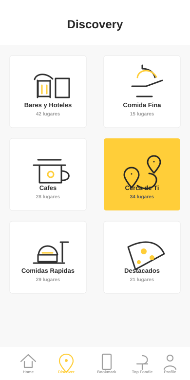

# Menu Android con Jetpack Compose

Este proyecto es una app Android sencilla hecha con Kotlin y Jetpack Compose. La pantalla principal muestra un menu visual tipo "Discovery", con un encabezado, una grilla de categorias y una barra inferior de navegacion.

El archivo principal que contiene la pantalla es:

```text
app/src/main/java/com/example/menu_android_001/MainActivity.kt
```

## Que se construyo

La pantalla actual tiene estas partes:

- Un titulo superior: `Discovery`.
- Un fondo claro para la zona principal.
- Una grilla de 2 columnas con tarjetas.
- Cada tarjeta muestra:
  - Un icono dibujado con `Canvas`.
  - Un titulo.
  - Una cantidad de lugares.
- Una tarjeta destacada en amarillo.
- Una barra inferior con opciones como `Home`, `Discover`, `Bookmark`, `Top Foodie` y `Profile`.

Todo esto esta hecho con Jetpack Compose. No se usaron archivos XML para el diseno.

## Que es Jetpack Compose

Jetpack Compose es la forma moderna de crear interfaces en Android usando Kotlin.

Antes, muchas apps Android se hacian con archivos XML como:

```text
activity_main.xml
```

Con Compose, la interfaz se escribe directamente en Kotlin usando funciones llamadas `Composable`.

Ejemplo sencillo:

```kotlin
@Composable
fun Saludo() {
    Text(text = "Hola")
}
```

Esa funcion dibuja un texto en pantalla.

## Que es Kotlin

Kotlin es el lenguaje usado para programar la app Android.

Algunas ideas basicas:

### Variables

```kotlin
val nombre = "Discovery"
```

`val` significa que el valor no cambia.

```kotlin
var contador = 0
```

`var` significa que el valor si puede cambiar.

En este proyecto se usa mucho `val`, porque los colores, textos y listas del menu no necesitan cambiar mientras la pantalla se dibuja.

### Funciones

Una funcion agrupa codigo para reutilizarlo.

```kotlin
fun sumar(a: Int, b: Int): Int {
    return a + b
}
```

En Compose, muchas funciones representan partes visuales de la pantalla:

```kotlin
@Composable
fun DiscoveryMenu() {
    // Contenido visual
}
```

### Clases de datos

En este proyecto existe esta clase:

```kotlin
private data class MenuItem(
    val title: String,
    val places: String,
    val icon: MenuIcon,
    val highlighted: Boolean = false
)
```

Esta clase representa una tarjeta del menu.

Por ejemplo:

```kotlin
MenuItem("Cafes", "28 lugares", MenuIcon.Cafe)
```

Significa:

- Titulo: `Cafes`
- Subtitulo: `28 lugares`
- Icono: `Cafe`
- No esta destacada, porque `highlighted` queda en `false`

Este otro ejemplo si esta destacado:

```kotlin
MenuItem("Cerca de Ti", "34 lugares", MenuIcon.Nearby, highlighted = true)
```

## Estructura general del proyecto

Los archivos mas importantes son:

```text
app/src/main/java/com/example/menu_android_001/MainActivity.kt
```

Aqui esta la pantalla principal.

```text
app/src/main/java/com/example/menu_android_001/ui/theme/Theme.kt
```

Aqui esta el tema visual general de Compose.

```text
app/build.gradle.kts
```

Aqui estan las dependencias del modulo Android.

```text
gradle/libs.versions.toml
```

Aqui se administran versiones de librerias y plugins.

## Explicacion de MainActivity.kt

### 1. Paquete e imports

Al inicio del archivo aparece:

```kotlin
package com.example.menu_android_001
```

Esto indica a que paquete pertenece el archivo.

Despues vienen muchos `import`, por ejemplo:

```kotlin
import androidx.compose.material3.Text
import androidx.compose.foundation.layout.Column
import androidx.compose.foundation.lazy.grid.LazyVerticalGrid
```

Los imports permiten usar componentes de Compose como `Text`, `Column`, `Row`, `Card`, `Canvas`, etc.

### 2. MainActivity

Esta es la actividad principal de la app:

```kotlin
class MainActivity : ComponentActivity() {
    override fun onCreate(savedInstanceState: Bundle?) {
        super.onCreate(savedInstanceState)
        enableEdgeToEdge()
        setContent {
            Menu_android_001Theme {
                DiscoveryMenu()
            }
        }
    }
}
```

Explicacion:

- `MainActivity` es la pantalla inicial de la app.
- `onCreate` se ejecuta cuando la pantalla se crea.
- `enableEdgeToEdge()` permite que la app use mejor el espacio de pantalla.
- `setContent { ... }` le dice a Android que la interfaz se hara con Compose.
- `Menu_android_001Theme { ... }` aplica el tema visual del proyecto.
- `DiscoveryMenu()` dibuja la pantalla del menu.

### 3. Colores

El proyecto define colores asi:

```kotlin
private val Golden = Color(0xFFFFCE39)
private val Ink = Color(0xFF262626)
private val Muted = Color(0xFF9E9E9E)
private val Panel = Color(0xFFF8F8F8)
```

Cada color usa formato hexadecimal.

Por ejemplo:

```kotlin
Color(0xFFFFCE39)
```

Ese es el amarillo usado en la tarjeta destacada y en el boton seleccionado de la barra inferior.

Si quieres cambiar el amarillo principal, cambia `Golden`.

### 4. Enum de iconos

```kotlin
private enum class MenuIcon {
    Hotel, Dining, Cafe, Nearby, FastFood, Featured
}
```

Un `enum` define opciones fijas.

Aqui se usa para indicar que tipo de icono debe mostrar cada tarjeta.

Por ejemplo:

```kotlin
MenuIcon.Cafe
```

significa que esa tarjeta usara el icono de cafe.

### 5. Datos del menu

La lista de tarjetas esta aqui:

```kotlin
private val menuItems = listOf(
    MenuItem("Bares y Hoteles", "42 lugares", MenuIcon.Hotel),
    MenuItem("Comida Fina", "15 lugares", MenuIcon.Dining),
    MenuItem("Cafes", "28 lugares", MenuIcon.Cafe),
    MenuItem("Cerca de Ti", "34 lugares", MenuIcon.Nearby, highlighted = true),
    MenuItem("Comidas Rapidas", "29 lugares", MenuIcon.FastFood),
    MenuItem("Destacados", "21 lugares", MenuIcon.Featured)
)
```

Si quieres cambiar el texto de una tarjeta, edita esta lista.

Ejemplo:

```kotlin
MenuItem("Postres", "12 lugares", MenuIcon.Featured)
```

Si quieres que una tarjeta sea amarilla, pon:

```kotlin
highlighted = true
```

Solo una tarjeta deberia estar destacada para que el diseno se vea limpio.

### 6. Datos de la barra inferior

```kotlin
private val bottomItems = listOf("Home", "Discover", "Bookmark", "Top Foodie", "Profile")
```

Esta lista define los textos de la barra inferior.

Si quieres cambiar `Discover` por `Buscar`, puedes hacer:

```kotlin
private val bottomItems = listOf("Home", "Buscar", "Bookmark", "Top Foodie", "Profile")
```

## Como se dibuja la pantalla

### DiscoveryMenu

```kotlin
@Composable
fun DiscoveryMenu() {
    Scaffold(
        modifier = Modifier.fillMaxSize(),
        containerColor = Panel
    ) { innerPadding ->
        MainMenuScreen(
            modifier = Modifier
                .fillMaxSize()
                .padding(innerPadding)
        )
    }
}
```

`DiscoveryMenu` es la pantalla completa.

Usa `Scaffold`, que es un contenedor de Material Design. Sirve para organizar pantallas con barras superiores, barras inferiores y contenido.

En este caso se usa para ocupar toda la pantalla y respetar los espacios del sistema.

### MainMenuScreen

```kotlin
@Composable
private fun MainMenuScreen(
    modifier: Modifier = Modifier
) {
    Column(
        modifier = modifier.background(Panel),
        horizontalAlignment = Alignment.CenterHorizontally
    ) {
        ...
    }
}
```

`MainMenuScreen` organiza la pantalla verticalmente.

Usa `Column`, que coloca elementos uno debajo del otro.

La pantalla tiene tres secciones principales:

1. Encabezado blanco con el titulo.
2. Grilla de tarjetas.
3. Barra inferior.

## Componentes importantes de Compose usados

### Column

`Column` coloca elementos verticalmente.

Ejemplo:

```kotlin
Column {
    Text("Arriba")
    Text("Abajo")
}
```

Resultado:

```text
Arriba
Abajo
```

### Row

`Row` coloca elementos horizontalmente.

Ejemplo:

```kotlin
Row {
    Text("Izquierda")
    Text("Derecha")
}
```

### Text

`Text` muestra texto.

Ejemplo:

```kotlin
Text(
    text = "Discovery",
    fontSize = 24.sp,
    fontWeight = FontWeight.ExtraBold
)
```

### Card

`Card` sirve para crear tarjetas visuales.

En este proyecto, cada categoria del menu es una tarjeta.

```kotlin
Card(
    shape = RoundedCornerShape(4.dp),
    elevation = CardDefaults.cardElevation(defaultElevation = 4.dp)
) {
    // Contenido de la tarjeta
}
```

### LazyVerticalGrid

`LazyVerticalGrid` muestra elementos en forma de grilla.

```kotlin
LazyVerticalGrid(
    columns = GridCells.Fixed(2)
) {
    items(menuItems) { item ->
        CategoryCard(item = item)
    }
}
```

Explicacion:

- `GridCells.Fixed(2)` crea 2 columnas.
- `items(menuItems)` recorre la lista de tarjetas.
- Por cada elemento, dibuja un `CategoryCard`.

### Canvas

`Canvas` permite dibujar formas manualmente.

En este proyecto se usa para dibujar los iconos sin usar imagenes externas.

Ejemplo:

```kotlin
Canvas(modifier = Modifier.size(58.dp)) {
    drawCircle(color = Color.Black, radius = 20f)
}
```

Con `Canvas` puedes dibujar:

- Lineas.
- Circulos.
- Arcos.
- Rectangulos.
- Figuras personalizadas con `Path`.

## Que es Modifier

`Modifier` es una de las ideas mas importantes en Compose.

Sirve para decir como se ve o como se comporta un componente.

Ejemplo:

```kotlin
Modifier
    .fillMaxWidth()
    .padding(20.dp)
    .background(Color.White)
```

Esto significa:

1. Ocupa todo el ancho disponible.
2. Tiene espacio interno o externo de 20 dp, segun donde se use.
3. Tiene fondo blanco.

En Compose, el orden de los modifiers importa.

Ejemplo:

```kotlin
Modifier
    .background(Color.Yellow)
    .padding(20.dp)
```

Primero pinta el fondo y luego aplica padding.

En cambio:

```kotlin
Modifier
    .padding(20.dp)
    .background(Color.Yellow)
```

Primero aplica padding y luego pinta el fondo solo en el area restante.

## Que son dp y sp

### dp

`dp` se usa para tamanos visuales:

```kotlin
height(68.dp)
padding(20.dp)
size(58.dp)
```

Usa `dp` para:

- Anchos.
- Altos.
- Espaciados.
- Tamanos de iconos.
- Bordes.

### sp

`sp` se usa para texto:

```kotlin
fontSize = 24.sp
```

Usa `sp` para tamanos de fuente.

## Como ver el diseno mientras trabajas

### Opcion 1: Preview de Compose

Al final de `MainActivity.kt` esta esta funcion:

```kotlin
@Preview(showBackground = true, widthDp = 390, heightDp = 780)
@Composable
fun DiscoveryMenuPreview() {
    Menu_android_001Theme {
        DiscoveryMenu()
    }
}
```

Esto permite ver la pantalla en Android Studio sin instalar la app.

Pasos:

1. Abre `MainActivity.kt`.
2. En la parte superior derecha del editor, selecciona `Split` o `Design`.
3. Android Studio mostrara el preview.
4. Si no se actualiza, presiona `Build & Refresh`.

### Opcion 2: Ejecutar en celular o emulador

Pasos:

1. Abre Android Studio.
2. Conecta tu celular o inicia un emulador.
3. Presiona el boton verde `Run`.
4. La app se instalara y podras ver la pantalla real.

### Opcion 3: Live Edit

Live Edit permite ver algunos cambios de Compose casi en vivo.

Pasos generales:

1. Abre `Settings`.
2. Busca `Live Edit`.
3. Activalo.
4. Ejecuta la app.
5. Cambia valores simples como textos, colores o tamanos.

No todos los cambios se actualizan en vivo. Si algo no aparece, vuelve a ejecutar la app.

## Como cambiar cosas comunes

### Cambiar el titulo

Busca:

```kotlin
text = "Discovery"
```

Cambialo por:

```kotlin
text = "Mi Menu"
```

### Cambiar el color amarillo

Busca:

```kotlin
private val Golden = Color(0xFFFFCE39)
```

Cambialo por otro color:

```kotlin
private val Golden = Color(0xFFFFB000)
```

### Cambiar el fondo

Busca:

```kotlin
private val Panel = Color(0xFFF8F8F8)
```

Puedes probar:

```kotlin
private val Panel = Color(0xFFF2F4F7)
```

### Cambiar una tarjeta

Busca la lista `menuItems`:

```kotlin
MenuItem("Cafes", "28 lugares", MenuIcon.Cafe)
```

Cambiala por:

```kotlin
MenuItem("Postres", "12 lugares", MenuIcon.Featured)
```

### Agregar otra tarjeta

Agrega otro elemento en la lista:

```kotlin
MenuItem("Bebidas", "18 lugares", MenuIcon.Cafe)
```

Ten en cuenta que la grilla esta en 2 columnas. Si agregas muchas tarjetas, podras hacer scroll.

### Cambiar cual tarjeta esta destacada

Actualmente esta destacada:

```kotlin
MenuItem("Cerca de Ti", "34 lugares", MenuIcon.Nearby, highlighted = true)
```

Puedes mover `highlighted = true` a otra tarjeta.

Ejemplo:

```kotlin
MenuItem("Comida Fina", "15 lugares", MenuIcon.Dining, highlighted = true)
```

## Como funcionan las tarjetas

La funcion que dibuja cada tarjeta es:

```kotlin
@Composable
private fun CategoryCard(item: MenuItem) {
    ...
}
```

Esta funcion recibe un `MenuItem`.

Luego decide colores:

```kotlin
val background = if (item.highlighted) Golden else Color.White
val content = if (item.highlighted) Ink else Color(0xFF303030)
val supporting = if (item.highlighted) Ink.copy(alpha = 0.68f) else Muted
```

Esto significa:

- Si la tarjeta esta destacada, el fondo es amarillo.
- Si no esta destacada, el fondo es blanco.
- El texto secundario cambia de color segun el estado.

Despues dibuja una `Card` con una `Column` adentro.

Dentro de esa columna se ponen:

1. El icono.
2. Un espacio vertical.
3. El titulo.
4. El subtitulo.

## Como funcionan los iconos

Los iconos se dibujan con esta funcion:

```kotlin
@Composable
private fun MenuIllustration(icon: MenuIcon, tint: Color, accent: Color) {
    Canvas(modifier = Modifier.size(58.dp)) {
        when (icon) {
            MenuIcon.Hotel -> drawHotelIcon(tint, accent)
            MenuIcon.Dining -> drawDiningIcon(tint, accent)
            MenuIcon.Cafe -> drawCafeIcon(tint, accent)
            MenuIcon.Nearby -> drawNearbyIcon(tint)
            MenuIcon.FastFood -> drawFastFoodIcon(tint, accent)
            MenuIcon.Featured -> drawFeaturedIcon(tint, accent)
        }
    }
}
```

`when` en Kotlin es parecido a un `switch` en otros lenguajes.

Si el icono es `MenuIcon.Cafe`, se ejecuta:

```kotlin
drawCafeIcon(tint, accent)
```

Cada funcion `draw...Icon` dibuja lineas, circulos y formas.

Por ejemplo:

```kotlin
drawLine(...)
drawCircle(...)
drawRoundRect(...)
drawPath(...)
```

No necesitas entender todos los detalles de los dibujos al principio. Lo importante es saber que esos metodos crean los iconos manualmente.

## Como funciona la barra inferior

La funcion es:

```kotlin
@Composable
private fun BottomNavigation() {
    Row(...)
}
```

Usa `Row` porque los elementos van uno al lado del otro.

Esta linea recorre todos los textos:

```kotlin
bottomItems.forEachIndexed { index, label ->
```

`index` es la posicion:

- 0 para `Home`
- 1 para `Discover`
- 2 para `Bookmark`
- 3 para `Top Foodie`
- 4 para `Profile`

Esta linea marca `Discover` como seleccionado:

```kotlin
val selected = index == 1
```

Si quieres seleccionar `Home`, cambia a:

```kotlin
val selected = index == 0
```

Si quieres seleccionar `Profile`, cambia a:

```kotlin
val selected = index == 4
```

## Por que ahora ocupa toda la pantalla

Antes el diseno tenia un contenedor con tamano fijo, como:

```kotlin
width(330.dp)
height(650.dp)
```

Eso hacia que pareciera un celular dentro del celular.

Ahora se usa:

```kotlin
Modifier.fillMaxSize()
```

Esto hace que la app use todo el espacio disponible en la pantalla real.

## Comandos utiles

### Compilar la app

En PowerShell, desde la carpeta del proyecto:

```powershell
$env:JAVA_HOME='C:\Program Files\Android\Android Studio\jbr'; .\gradlew.bat assembleDebug
```

Si todo esta bien, al final veras:

```text
BUILD SUCCESSFUL
```

### Ejecutar desde Android Studio

Lo mas facil para comenzar es usar Android Studio:

1. Abre el proyecto.
2. Espera a que Gradle sincronice.
3. Conecta tu celular o abre un emulador.
4. Presiona `Run`.

## Errores comunes

### No aparece el Preview

Prueba esto:

1. Abre `MainActivity.kt`.
2. Cambia a la pestana `Split`.
3. Presiona `Build & Refresh`.
4. Si sigue sin aparecer, ejecuta `Sync Project with Gradle Files`.

### Error de JAVA_HOME

Si al compilar aparece:

```text
JAVA_HOME is not set
```

Puedes usar temporalmente el JDK de Android Studio:

```powershell
$env:JAVA_HOME='C:\Program Files\Android\Android Studio\jbr'
```

Despues compila:

```powershell
.\gradlew.bat assembleDebug
```

### Cambie algo y se dano el diseno

Al aprender Compose, es normal que pase.

Los cambios mas sensibles suelen estar en:

- `Modifier.padding(...)`
- `Modifier.height(...)`
- `Modifier.width(...)`
- `Modifier.weight(...)`
- `LazyVerticalGrid`
- `Card`

Si algo se ve raro, revisa primero esos lugares.

## Recomendacion para aprender modificando este proyecto

Puedes practicar en este orden:

1. Cambia textos de las tarjetas.
2. Cambia colores.
3. Cambia tamanos de texto.
4. Cambia espaciados con `padding`.
5. Cambia que tarjeta esta destacada.
6. Agrega una nueva tarjeta.
7. Cambia el elemento seleccionado de la barra inferior.
8. Intenta crear un nuevo icono usando `Canvas`.

Ese orden ayuda porque empiezas con cambios simples antes de tocar partes mas dificiles.

## Resumen de conceptos que ya usa esta app

- `@Composable`: funcion que dibuja interfaz.
- `Scaffold`: estructura general de pantalla.
- `Column`: elementos en vertical.
- `Row`: elementos en horizontal.
- `Text`: texto en pantalla.
- `Card`: tarjeta visual.
- `LazyVerticalGrid`: grilla eficiente.
- `Canvas`: dibujo manual.
- `Modifier`: tamano, color, padding, clics y comportamiento.
- `dp`: medidas de interfaz.
- `sp`: medidas de texto.
- `data class`: modelo de datos.
- `enum class`: lista de opciones fijas.
- `listOf`: lista de elementos.
- `when`: seleccion segun una opcion.

## Punto de entrada para seguir aprendiendo

Si quieres entender el proyecto desde cero, empieza leyendo en este orden:

1. `MainActivity`
2. `DiscoveryMenu`
3. `MainMenuScreen`
4. `menuItems`
5. `CategoryCard`
6. `BottomNavigation`
7. `MenuIllustration`
8. Funciones `draw...Icon`

Las funciones de dibujo son lo mas avanzado. Puedes dejarlas para el final.

## Captura de pantalla de la app

Esta vista previa representa la pantalla principal actual de la app:




